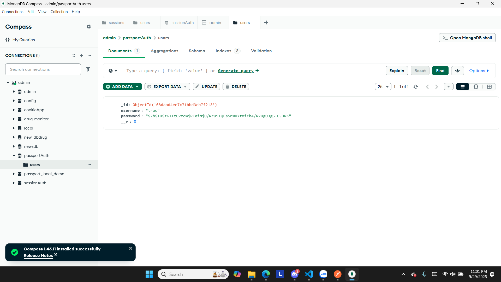
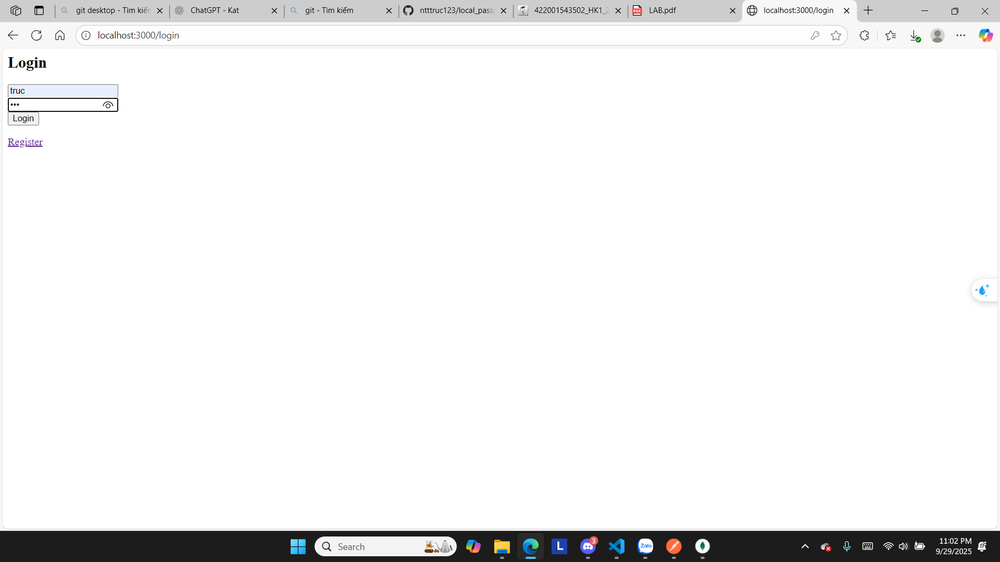
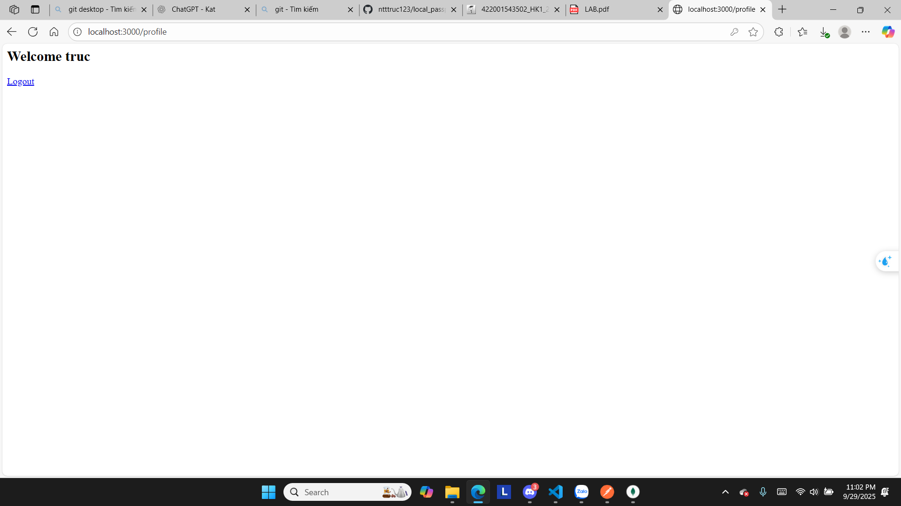

# local_passport_website
# 1. Run node app.js
[app](assets/image.png)
# 2. Đăng ký tài khoản với username và password

# Kiểm tra CSDL có lưu thành công tài khoản người dùng

# 3. Đăng nhập tài khoản với username và password

# 4. Đăng xuất thành công trở về trang Login